# Historic quiz
Historic Quiz is an engaging and educational quiz application that takes you on a journey through time. Test your knowledge of history with 10 randomly selected questions covering various eras, events, and personalities. From ancient civilizations to modern revolutions, this quiz will challenge and entertain history enthusiasts of all levels.
*Note - screenshots were done before the final styling. Next button is hidden when user did not submit the answer yet.

# User stories
| ID | User story |
| ---------------- | ---------------- | 
| 1# | As a user I want to see the purpose of the website when I open it, so that I know about what it is. |
| 2# | As a user I want to see the rules of the quiz, so that I know how to play it. |
| 3# | As a user I want to type my name into input field, so that I get personalized results. | 
| 4# | As a user, I want to have a clear direction, how to start the quiz. |
| 5# | As a user I want to be able to submit the correct answer, so that I can move to the next question. |
| 6# | As a user I want to be able to move to the next question. |
| 7# | As a user I want to have direct feedback on my submitted answer, so that I know which answer was a correct one. |
| 2# | As a user I want see progress, so that I know how many questions are left. |
| 3# | As a user I want to see the result page after I submitted the last question, so that I know how many I answered correctly.| 
| 4# | As a user, I want to see who is the author of the website |
# Diagram
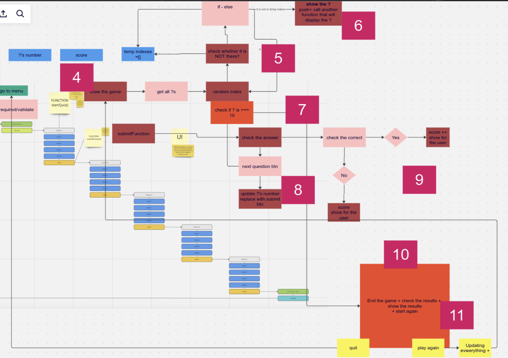
# Features
*Note - screenshots were done before the final styling. Next button is hidden when user did not submit the answer yet.
## Landing page
On the landing page, you are presented with an input field where users need to type their names. In the header, there are rules, and in the footer, you can find the name of the author. Users must type their names to start the quiz. Users can initiate the quiz by submitting the 'Start the quiz' button.
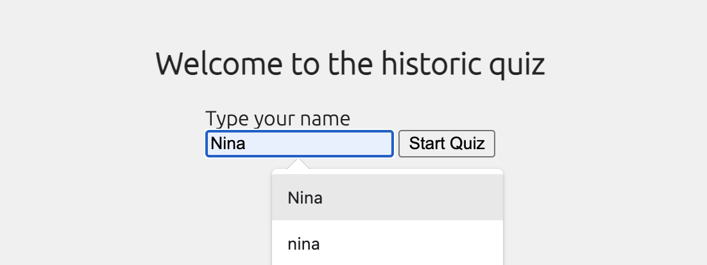
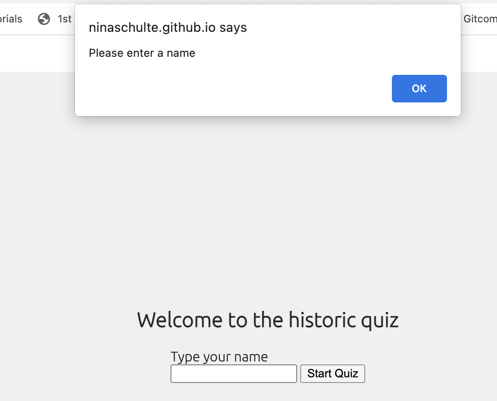
## Rules
The Button for rules in the header is accessible throughout the entire quiz. When the user taps on the button, it opens a dialog containing the quiz rules. Tapping the 'x' will close the dialog.
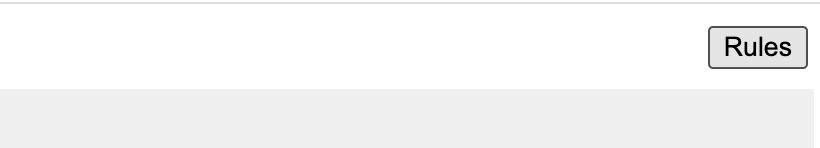
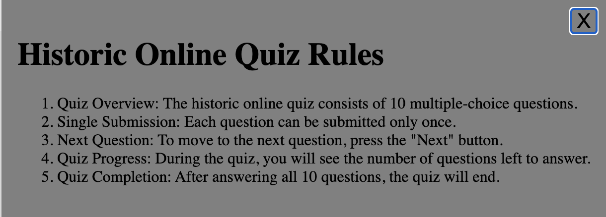
## Display Question
Quiz consists of 10 questions and 4 options under each question. Only one answer is correct, and once the user submits the question, the user can't change the response anymore.
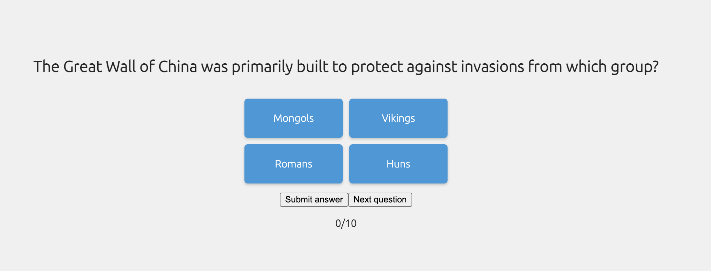
### Progress
Each question is also showing the progress of the user, so that the user knows how many more questions there are left to answer.
### Show correct answer
Once user submit the answer, application will show to the user the correct answer.

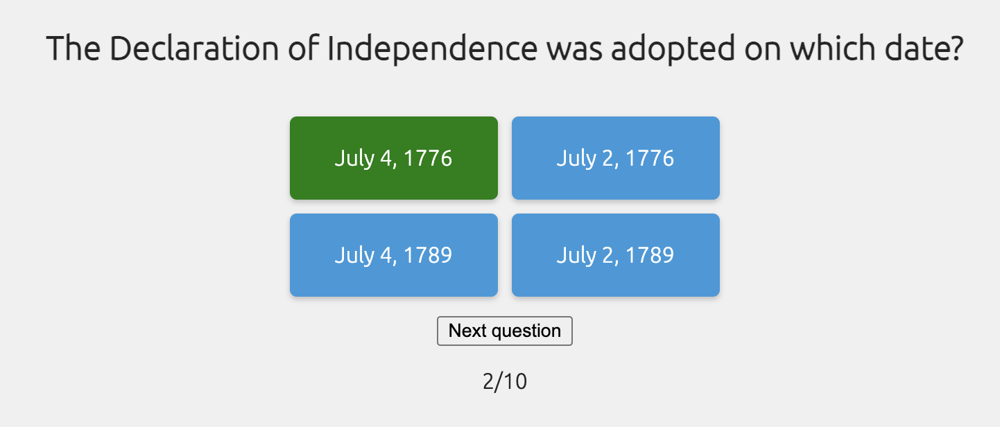
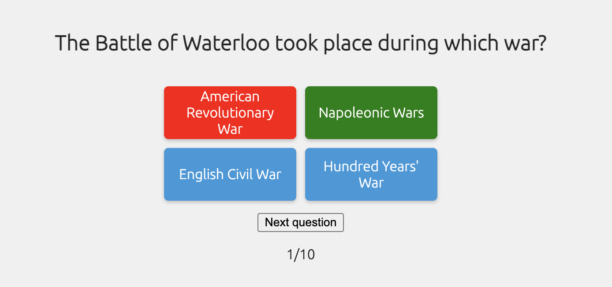
### Submit button and Next button
Every question has a submit button and a next button. Once an answer is selected and the submit button is clicked, the submit button will disappear. Users will have to click on the next button to proceed to the next question.
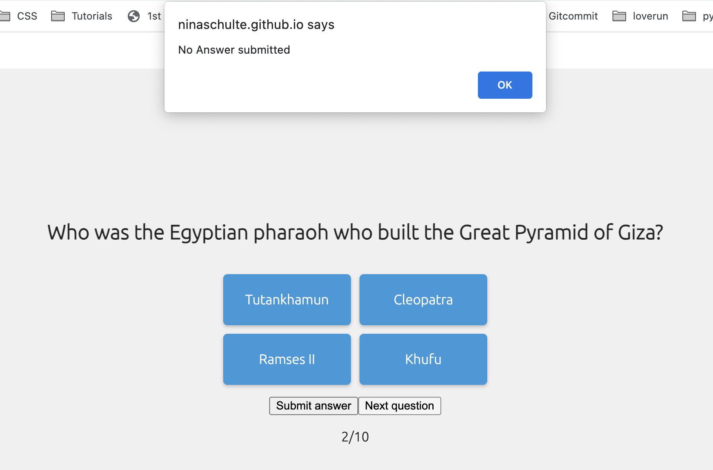
## Result page
The Result page is shown to the user after the user submits the 10th answer. The Result page will show the user the number of correct answers.
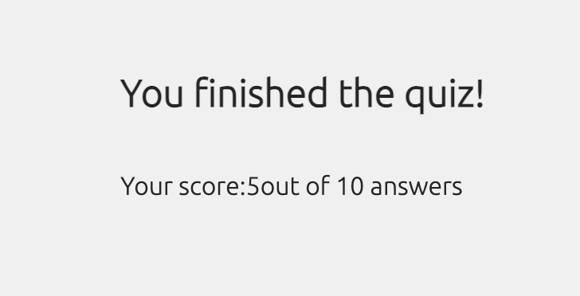
# Testing
- HTML
  - No errors were found when passing through the official HTML validator.
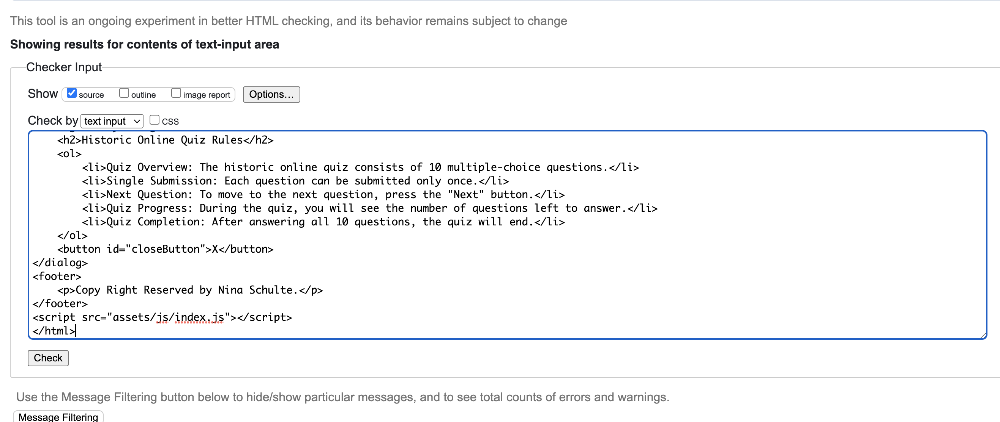
- CSS
  - No errors were found when passing through the official CSS validator.

- JavaScript
  - No errors were found when passing through the official Jshint validator.
  - There are 12 functions in this file.
  - Function with the largest signature takes 2 arguments, while the median is 0.
  - The largest function has 13 statements in it, while the median is 5.5.
  - The most complex function has a cyclomatic complexity value of 5 while the median is 2.
  
# Deployment 
This site was deployed to Github pages. Steps to deploy are as follows:

In the Github repository, navigate to the Setting tab,
From the source section drop-down menu, select the Master Branch
Once the master branch has been selected, the page provided the link to the completed website. The live can be found https://ninaschulte.github.io/historicquiz/
# Bugs
| Bug | Visual of a bug | Fix | Comments |
| ---------------- | ---------------- | ---------------- |  ---------------- |
| 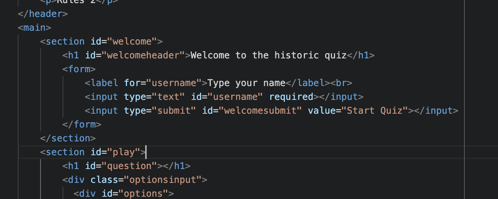  |   | 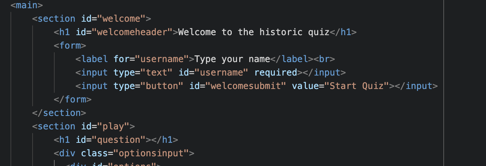  | Quiz didn´t start because I used for start quiz input submit. The bug was fixed once I change it to button. |
| 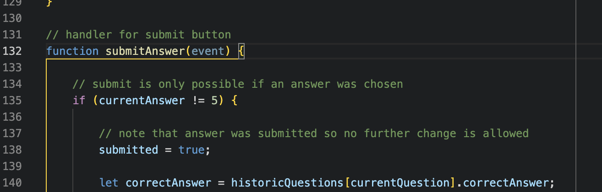  | 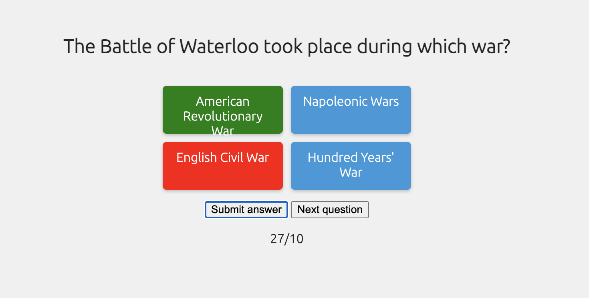  | 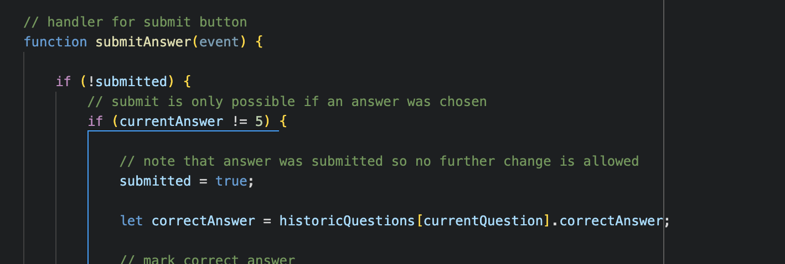   | Submit button was not showing alert message when clicking on it and instead the number on progress section was increasing. Bug solved with if !submitted. |
| 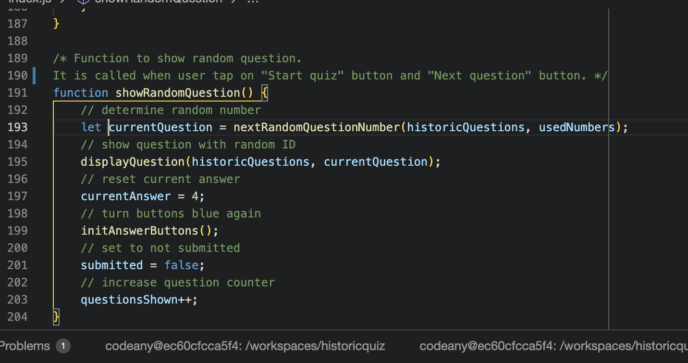  |   |   | The same option was always the correct one. Accidental local declaration removed. |
# Unresolved things
- Cosmetic topics:
  - style for all the buttons
  - space between the question titels and answers.
# Credits
- https://www.w3schools.com/js/default.asp - for writing many functions and also for trying it out before I added it to the CodeAnyWhere. 
- Dialog for rules was created using instructions on the following page: https://blog.webdevsimplified.com/2023-04/html-dialog/
